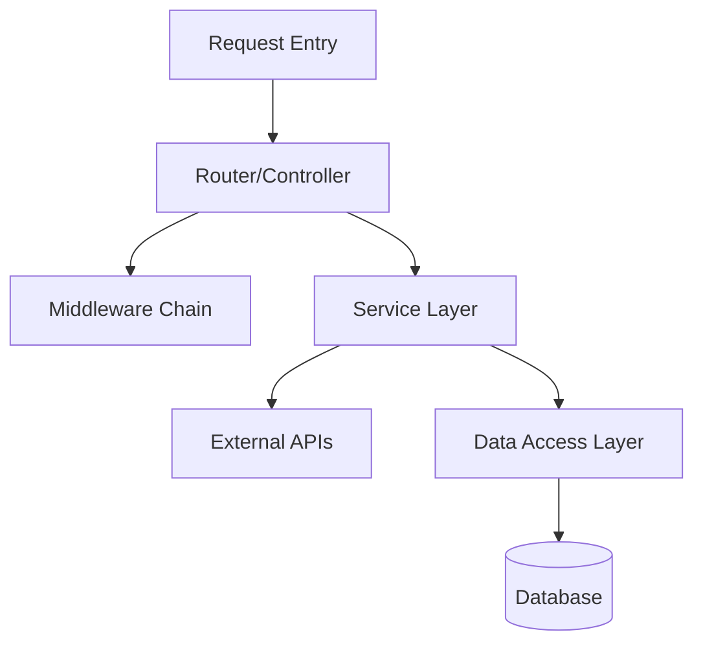
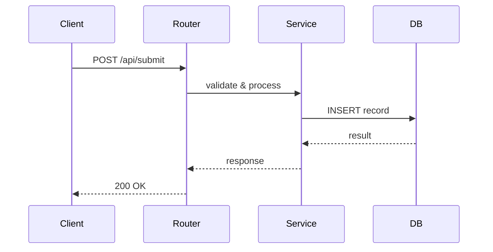

# Deep Repo Learner

Systematically learn a code repository and produce a **self-contained HTML report** with Mermaid diagrams rendered inline. The report follows a structured format covering project background, design philosophy, detailed system design with architecture and sequence diagrams, and an honest evaluation.

## Output Format

The final output is a single `.html` file that:
- Renders directly in any browser, zero dependencies needed
- Uses Mermaid.js (CDN) to render architecture diagrams and sequence diagrams inline
- Has a clean, professional reading experience optimized for both desktop and mobile
- Includes a sticky table of contents for navigation

For the HTML template and style details, see [references/html-template.md](references/html-template.md).

## Workflow

```
Phase 1: Reconnaissance        → project profile & tech stack
Phase 2: Architecture Mapping   → modules, layers, data flow, diagrams
Phase 3: Core Logic Deep-Dive   → implementation reasoning for key modules
Phase 4: Synthesis & HTML Report → assemble everything into the final HTML
```

---

## Phase 1: Reconnaissance

Fast scan to build a project profile. Use Glob and Grep strategically — do NOT read every file.

### 1.1 Locate the Repo

- GitHub URL → clone to `/tmp/deep-repo-learner-<name>`
- "this repo" / "current project" → use current working directory
- Local path → use directly

### 1.2 Project Profile

Read in parallel:

```
README.md, README_CN.md, CONTRIBUTING.md, ARCHITECTURE.md
package.json, pyproject.toml, Cargo.toml, go.mod, pom.xml, build.gradle
Makefile, Dockerfile, docker-compose.yml, .github/workflows/*
```

Extract:

```
项目名称:
一句话定义: (这个项目解决什么问题)
技术栈: (语言/框架/核心依赖)
构建方式: (如何 build/run/test)
项目规模: (文件数/代码量级估算)
目标用户: (谁在用，解决谁的问题)
```

### 1.3 Directory Structure Snapshot

Get top 3 levels of directory tree (ignore node_modules, vendor, .git, dist, build, __pycache__, target, .next). Annotate each top-level directory with its purpose.

---

## Phase 2: Architecture Mapping

### 2.1 Entry Point Tracing

Find all entry points and trace the first 2-3 levels of function calls to understand startup sequence.

### 2.2 Module Dependency Map

Identify core modules and their relationships. This will be rendered as a **Mermaid architecture diagram** in the report.

Build the Mermaid graph data:



### 2.3 Data Flow Trace

Pick the **most representative user action** and trace data through the entire system with file paths and line numbers. This will become the narrative in section 3.1.

### 2.4 Key Module Sequence Diagrams

For each of the 3-5 core modules identified, construct a **Mermaid sequence diagram** showing the interaction between components:



---

## Phase 3: Core Logic Deep-Dive

Select **3-5 core modules** that represent the project's key engineering decisions.

### 3.1 Module Selection Criteria

Pick modules that are:
- Central to the project's core value proposition
- Contain non-trivial logic (not just CRUD wrappers)
- Demonstrate interesting design patterns or trade-offs

### 3.2 Per-Module Analysis

For each module, analyze using the "问题 → 思考 → 方案 → 代价" framework:

1. **要解决的问题**: 这个模块存在的原因
2. **可选方案**: 列出 2-3 种实现方式
3. **选择了什么、为什么**: 当前实现的核心思路和选型理由
4. **代价与局限**: 这种选择牺牲了什么

Include:
- 核心代码片段 (≤25 行，关键行加中文注释)
- 对应的 Mermaid 时序图
- 设计模式识别（如果有）

### 3.3 Deep-Dive Principles

- **解释"为什么"而不只是"是什么"**
- **指出非显而易见的细节**: 边界条件处理、并发控制、性能优化
- **对比替代方案**: "如果不这样做，用 XXX 会有什么问题"
- **标注巧妙之处和遗憾之处**

---

## Phase 4: Synthesis & HTML Report

### 4.1 Document Structure (严格遵循)

The HTML report MUST follow this exact structure:

```
主标题: [项目名] 深度解读

副标题: [一句话技术定位，如"基于 XX 的 YY 系统"]

导语: [2-3 句概括：这个项目是什么，为什么值得研究，读完你将获得什么]

核心结论: [3-5 个 bullet points，最重要的发现/收获]

1 摘要
  1.1 项目背景
      [项目产生的背景、要解决的行业/技术痛点]
  1.2 项目预期
      1.2.1 预期一：[从分析中提炼，如"流程标准化"]
            [具体说明这个预期目标及实现方式]
      1.2.2 预期二：[如"研发提效"]
            [具体说明]
      (可根据项目实际情况增减预期条目)

2 项目设计理念
  2.1 理念一: [如"模块化解耦"]
      [解释这个设计理念在项目中如何体现]
  2.2 理念二: [如"约定优于配置"]
      [解释]
  2.3 理念三: [如"渐进式复杂度"]
      [解释]
  (从代码架构和设计决策中提炼，不少于 2 个，不超过 5 个)

3 系统详细设计
  3.1 系统架构设计
      [简要介绍整体架构]
      [Mermaid 架构图 — 直接在页面渲染]
      [架构图解读：各层/模块的职责说明]

  3.2 关键模块实现细节
      3.2.1 关键模块一：[模块名]
            [简要介绍：职责、实现思路、为什么这样设计]
            [Mermaid 时序图 — 直接在页面渲染]
            [核心代码片段 + 逐行解读]

      3.2.2 关键模块二：[模块名]
            [简要介绍]
            [Mermaid 时序图]
            [核心代码片段 + 逐行解读]

      3.2.3 关键模块三：[模块名]
            [简要介绍]
            [Mermaid 时序图]
            [核心代码片段 + 逐行解读]

      (3-5 个关键模块，根据项目复杂度调整)

4 方案评价
  4.1 优势分析
      [从架构设计、代码质量、可维护性、性能等维度分析优点]
  4.2 局限分析
      [诚实评价不足之处：技术债、扩展性瓶颈、缺失的能力等]
```

### 4.2 Mermaid Diagram Requirements

All diagrams use Mermaid.js rendered in-page. Agent must generate valid Mermaid syntax.

**Architecture Diagram (section 3.1)**: Use `graph TD` or `graph LR`.

```html
<div class="mermaid">
graph TD
    A[API Gateway] --> B[Auth Service]
    A --> C[Business Service]
    C --> D[Cache Layer]
    C --> E[(Database)]
    C --> F[Message Queue]
</div>
```

**Sequence Diagrams (section 3.2.x)**: Use `sequenceDiagram`.

```html
<div class="mermaid">
sequenceDiagram
    participant C as Client
    participant S as Service
    participant D as Database
    C->>S: request
    S->>D: query
    D-->>S: result
    S-->>C: response
</div>
```

Rules:
- Every diagram must be wrapped in `<div class="mermaid">...</div>`
- Architecture diagram: 5-12 nodes, grouped by layer/responsibility
- Sequence diagrams: show the key interaction flow, not every internal call
- Use Chinese labels where helpful (e.g., `A[认证服务]`)
- Node IDs must be simple alphanumeric (A, B, C or authSvc, bizSvc)

### 4.3 Code Snippet Formatting

Code snippets in the HTML use `<pre><code>` with syntax highlighting via Highlight.js (CDN):

```html
<pre><code class="language-typescript">// 文件: src/core/engine.ts (line 42-58)
function processRequest(req: Request): Response {
  // 校验输入：使用 zod schema 确保类型安全
  const validated = schema.parse(req.body);

  // 核心处理：策略模式根据 type 选择不同处理器
  const handler = handlerRegistry.get(validated.type);
  return handler.execute(validated);
}
</code></pre>
```

Rules:
- Always specify language class (`language-typescript`, `language-python`, etc.)
- First line comment: file path and line range
- Key logic lines: add Chinese comments explaining intent
- Max 25 lines per snippet

### 4.4 HTML Generation

Read [references/html-template.md](references/html-template.md) for the complete HTML template.

Write the final HTML to `<project-name>-deep-dive.html` in the current working directory.

After writing, open it in the browser:
```bash
open <project-name>-deep-dive.html  # macOS
```

### 4.5 Quality Checklist

Before finishing, verify:

- [ ] HTML file opens correctly in browser
- [ ] All Mermaid diagrams render without errors
- [ ] Section 3.1 has exactly one architecture diagram
- [ ] Each module in 3.2.x has exactly one sequence diagram
- [ ] Code snippets have file paths and line numbers
- [ ] 导语 and 核心结论 are filled with substantive content
- [ ] 设计理念 are extracted from real code patterns (not generic platitudes)
- [ ] 优势分析 and 局限分析 are honest and specific
- [ ] Total content: 3000-8000 Chinese characters
- [ ] Table of contents navigation works

### 4.6 Delivery

Present to user:
1. HTML file path
2. One-sentence summary: "这个项目的核心是 [X]，最值得学习的是 [Y]"
3. Suggested next step: deeper dive on a specific module, or generate a WeChat article

---

## Adapting to User Preferences

- User specifies a module → Phase 3 focuses on that module with doubled depth
- User says "快速了解" → Simplify to sections 1 + 3.1 + 4
- User says "我是新手" → Add more concept explanations, more detailed comments
- User says "关注性能" → Add performance analysis perspective in section 4
- User says "关注安全" → Add security audit perspective in section 4
- User wants a WeChat article → After analysis, invoke `repo-to-wechat-article` skill

## Additional Resources

- For the HTML template, see [references/html-template.md](references/html-template.md)
- For analysis patterns and techniques, see [references/analysis-patterns.md](references/analysis-patterns.md)
- For article generation from results, invoke the `repo-to-wechat-article` skill
