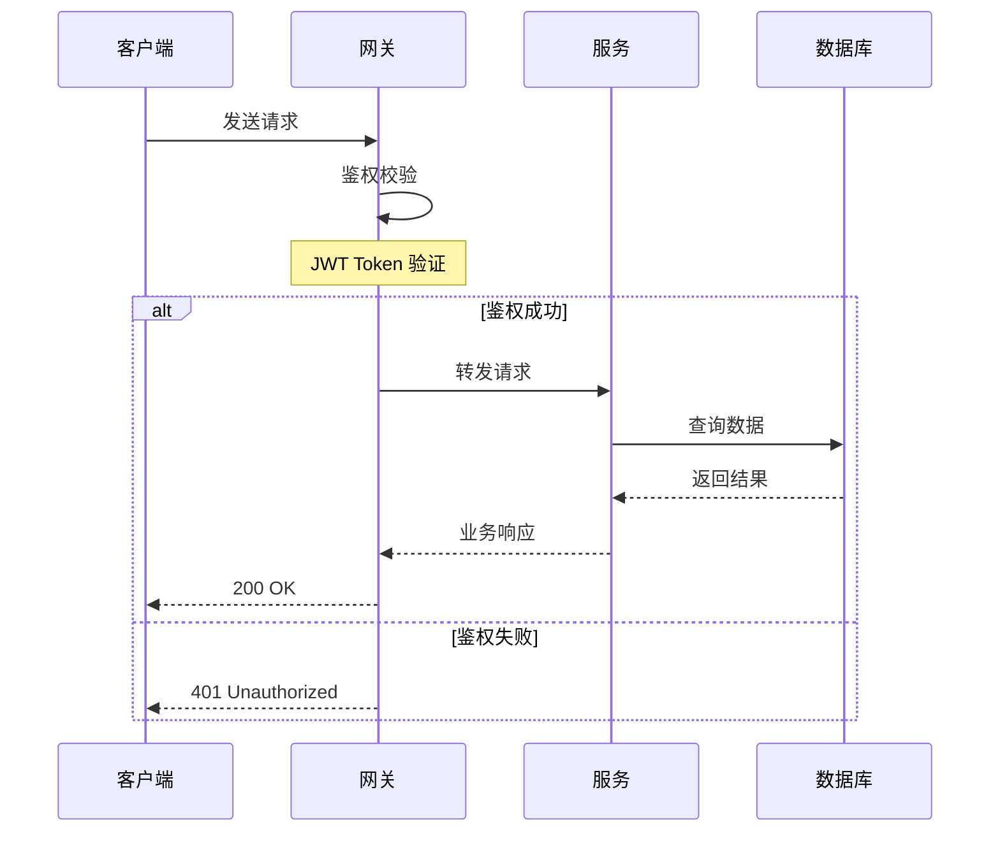

# Analysis Patterns

深度分析代码仓库时的常用模式和技巧参考。

---

## 入口追踪模式

不同技术栈的入口文件定位方式：

| 技术栈 | 入口文件 | 追踪起点 |
|--------|---------|---------|
| Node.js/Express | `app.js`, `server.ts`, `index.ts` | `app.listen()` 或 `createServer()` |
| React | `src/index.tsx`, `src/main.tsx` | `createRoot().render()` |
| Vue | `src/main.ts` | `createApp().mount()` |
| Python/Flask | `app.py`, `wsgi.py` | `app = Flask(__name__)` |
| Python/FastAPI | `main.py`, `app.py` | `app = FastAPI()` |
| Go | `cmd/*/main.go`, `main.go` | `func main()` |
| Rust | `src/main.rs`, `src/lib.rs` | `fn main()` 或 `pub fn` |
| Java/Spring | `*Application.java` | `@SpringBootApplication` |

## 核心模块识别信号

以下信号表明一个模块是"核心"的：

- **被大量导入**: Grep `import.*from.*module-name` 出现频率高
- **文件较大**: 超过 200 行的非配置文件
- **包含业务术语**: 文件名/函数名使用领域词汇而非通用词汇
- **有独立测试**: 对应的测试文件存在且测试用例多
- **位于核心路径**: 在请求生命周期的中间环节

## 设计理念提炼方法

从代码中提炼"设计理念"（用于报告 Section 2），使用以下信号：

| 代码信号 | 可能的设计理念 |
|---------|-------------|
| 大量接口/抽象类 + 依赖注入 | 模块化解耦 |
| 约定式目录结构 + 零配置运行 | 约定优于配置 |
| 渐进式 API（简单用法 → 高级用法） | 渐进式复杂度 |
| 完善的错误类型 + 重试/降级 | 防御性编程 |
| 大量缓存 + 懒加载 + 批处理 | 性能优先 |
| 插件系统 + hook 机制 | 可扩展性设计 |
| 详细的类型定义 + schema 校验 | 类型安全 / 契约驱动 |
| 每个模块独立可测 + mock 友好 | 可测试性设计 |

## 实现思路分析框架

对每个关键模块（报告 Section 3.2.x），用以下框架分析：

### 问题 → 思考 → 方案 → 代价

```
问题: 这个模块要解决什么问题？
思考: 有哪些可选方案？(列出 2-3 种)
方案: 选择了什么，为什么？
代价: 这样做牺牲了什么？
```

## Mermaid 图构建技巧

### 架构图 (Section 3.1)

选择合适的方向：
- `graph TD`（上到下）: 适合分层架构（展示层→业务层→数据层）
- `graph LR`（左到右）: 适合流水线（输入→处理→输出）

节点样式：
```
A[普通模块]      — 方括号
B[(数据库)]      — 圆柱体
C{判断/路由}     — 菱形
D([服务])        — 体育场形
E[[子系统]]      — 双方括号
```

### 时序图 (Section 3.2.x)

关键原则：
- participant 用中文别名：`participant S as 服务层`
- 只展示关键交互，不画内部调用
- 用 `Note over` 标注关键决策点
- 用 `alt/else` 展示条件分支
- 用 `loop` 展示循环/重试



## 优势/局限分析维度

评价时（报告 Section 4）从以下维度切入：

### 优势维度
- **架构设计**: 分层是否清晰、职责是否单一
- **代码质量**: 可读性、命名规范、错误处理
- **可维护性**: 模块边界、依赖管理、文档
- **可扩展性**: 是否容易添加新功能
- **性能设计**: 缓存、批处理、异步
- **安全性**: 输入校验、权限控制、敏感数据处理

### 局限维度
- **技术债**: TODO/HACK 数量、过时依赖
- **扩展瓶颈**: 哪里会成为性能瓶颈
- **缺失能力**: 监控、日志、限流、降级
- **测试不足**: 覆盖率低的关键路径
- **文档欠缺**: 缺少架构说明或 API 文档
